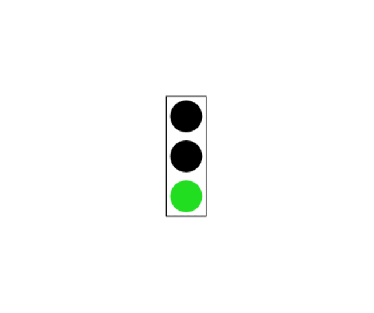
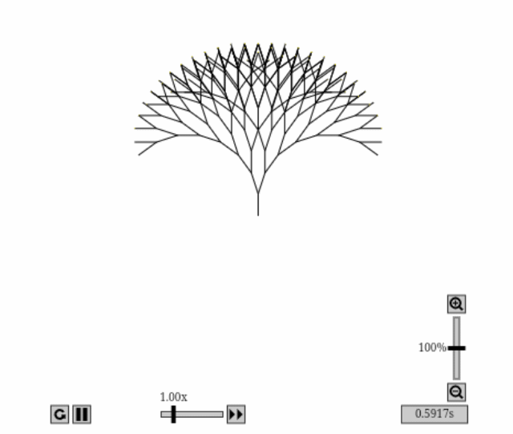
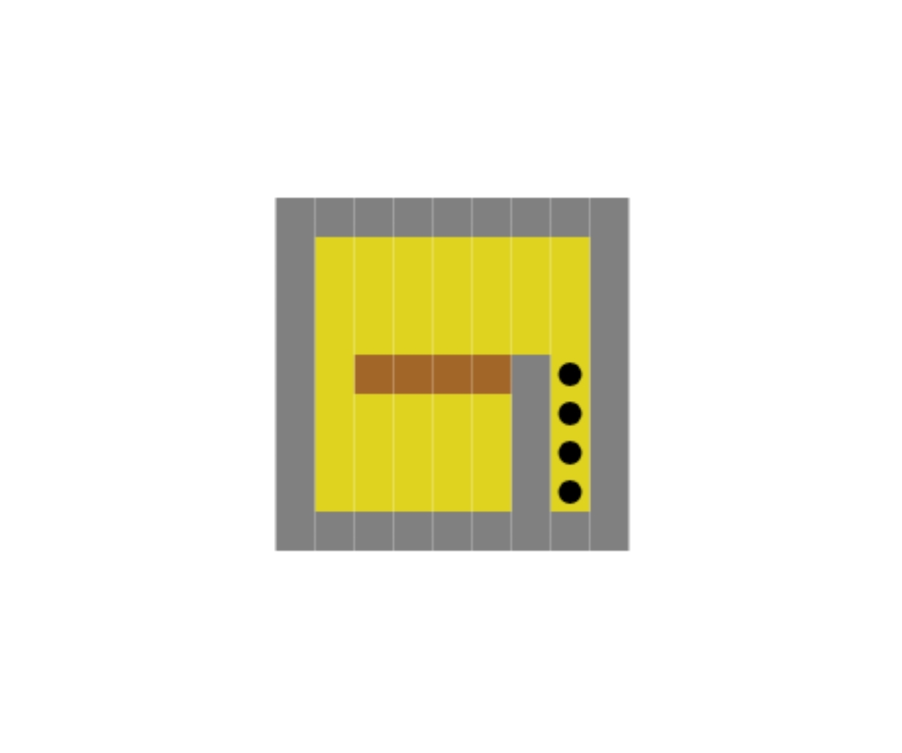

# Haskell via Sokoban

Поиграть в игру, которую вы напишете, если сделаете все ДЗ, можно [тут](https://code.world/run.html?mode=haskell&dhash=Do_TSjo_kT2I_94n5lv6w4Q).

Среда разработки: https://code.world/haskell

Шаблон и инструкция для желающих работать с кодом локально: https://github.com/artemohanjanyan/codeworld-template

Занятия ведутся по [этому материалу](https://haskell-via-sokoban.nomeata.de/).

# Лекция №1

[Запись лекции](https://youtu.be/_6pB7kkFO3Y).

Код с лекции: [GitHub](Lectures/Lec1.hs), [CodeWorld](https://code.world/haskell#PLdEYQSrD0LMQywOPfzcYcA).

## Домашнее задание №1

При решении заданий пытайтесь не просто писать хоть какой-то код, который работает, а делать его красивым и лаконичным. Постарайтесь писать маленькие функции, которые выполняют одну маленькую задачу, и затем используйте эти маленькие функции для более сложных функций. Избегайте повторений кода.

В заданиях вам предстоит создать много рисунков и анимаций. Будет описано, что от вас требуется, но вы всегда можете добавить что-нибудь от себя, дайте волю своему творчеству 💃

Присылайте решения мне в телеграм @artemohanjanyan в любом удобном вам виде, например просто ссылкой на code.world.

### 1.1 Светофор
На лекции мы сделали анимацию двуцветного светофора. Добавьте в него жёлтый свет и анимируйте следующие фазы светофора:

- Длинная фаза зелёного света;
- Короткая фаза жёлтого света;
- Длинная фаза красного света;
- Короткая фаза красного с жёлтым;
- Обратно к зелёному свету.

Можете добавить больше фаз, чтобы светофоры были больше похожи на украинские.

[Код светофора с лекции](https://code.world/haskell#Puzl_r5WNKnabTJkU4sjHgQ), можете начать с него.

Пример:



[Решение](Solutions/1.1.hs), [Разбор](https://youtu.be/7meF_qrOqx4).

### 1.2 Цветущие деревья
На лекции мы нарисовали дерево, но оно выглядит суховато.

```haskell
tree :: Integer -> Picture
tree 0 = blank
tree n = polyline [(0,0),(0,1)] & translated 0 1 (
  rotated (pi/10) (tree (n-1)) & rotated (- pi/10) (tree (n-1)))
```

Сделайте, чтобы оно зацвело! Создайте анимацию дерева, которое сначала выглядит как сухое дерево с лекции, а затем начинает цвести на крайних ветках. В течение 10 секунд цветы на ветках должны увеличиваться. Через 10 секунд дерево должно полностью расцвести, и анимация должна остановиться.

Примеры того, как могут выглядеть цветки на деревьях: 🟡, 💮, 🌻, 🏵️.

В коде сделайте так, чтобы функция отрисовки дерева не зависила от времени и от того, как выглядит цветок.

Пример:



[Решение](Solutions/1.2.hs), [Разбор](https://youtu.be/2fVzBF8MB-M).

### 1.3 Поле для игры Сокобан
К концу курса вы реализуете игру Сокобан. Можете почитать про игру [на википедии](https://uk.wikipedia.org/wiki/Sokoban), там ещё есть классная анимация.

>Гра відбувається на дошці з квадратів, де кожен квадрат є підлогою або стіною. Деякі квадрати містять ящики, а деякі — позначені, як їхні місця зберігання.

>Гравець обмежений дошкою, і може рухатися горизонтально або вертикально на порожні квадрати (не через стіни або ящики). Також гравець може переміститися на місце ящика, штовхаючи його на вільне місце за ним. Ящик не можна рухати на  інший ящик або стіну. Кількість ящиків дорівнює кількості місць зберігання. Головоломка вирішена, коли всі ящики опинились на місцях зберігання.

В этом задании надо научиться рисовать всё, что нам потребуется для отрисовки игрового поля:
1. Стены;
2. Землю, т.е. пустое пространство;
3. Землю с меткой, на которую нужно подвинуть ящик;
4. Ящики.

Можете начать с [этого кода](https://code.world/haskell#PhaxQVa5_9uWXva_quQwPcA).

Реализуйте функции `wall`, `ground`, `storage` и `box` типа `Picture`, которые рисуют соответствующие поля. Каждое должно быть ширины и высоты 1, располагаться в центре. Чем поля красивее, тем в игру приятнее играть 🙂

Реализуйте функцию `drawTile :: Integer -> Picture`, которая рисует поле соответствующего номера от 1 до 4 из списка выше. Если аргумент функции это не число от 1 до 4, функция не должна ничего рисовать (но и не должна падать).

Уровень игры может быть представлен как фукнция типа `Integer -> Integer -> Integer`, которая по координатам клетки возвращает номер вида поля из списка выше. Пока что у нас будет один уровень:

```haskell
maze :: Integer -> Integer -> Integer
maze x y
  | abs x > 4  || abs y > 4  = 0
  | abs x == 4 || abs y == 4 = 1
  | x ==  2 && y <= 0        = 1
  | x ==  3 && y <= 0        = 3
  | x >= -2 && y == 0        = 4
  | otherwise                = 2
```

Реализуйте функцию, которая отрисовывает этот уровень:

```haskell
pictureOfMaze :: Picture
```
Она должна для каждой координаты (x, y), где x, y ∈ [-10…10], определить вид поля с помощью функции `maze`, отрисовать его с помощью функции `drawTile`, и с помощью функции `translated` переместить поле на соответствующую координате позицию.

Нужно написать что-то вроде функции `manyTrafficLights` с лекции. Скорее всего, у вас будет одна рекурсивная функция, которая будет отрисовывать строчку за строчкой, и строчки, в свою очередь, будут отрисовываться другой рекурсивной функцией, которая будет отрисовывать поле в каждом столбце соответствующей строчки.

Фукция `main` должна рисовать `pictureOfMaze`.

Пример:



[Решение](Solutions/1.3.hs), [Разбор](https://youtu.be/OtoZRp8twbY).

# Лекция №2

[Запись лекции](https://youtu.be/GgmFWDZSqLE).

Код с лекции: [GitHub](Lectures/Lec2.hs), [CodeWorld](https://code.world/haskell#P_zf_4OMwaBegYiSnS16xUQ).
